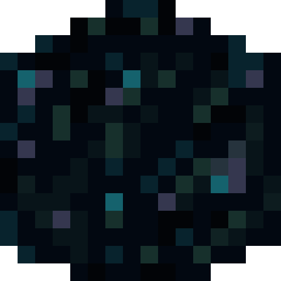
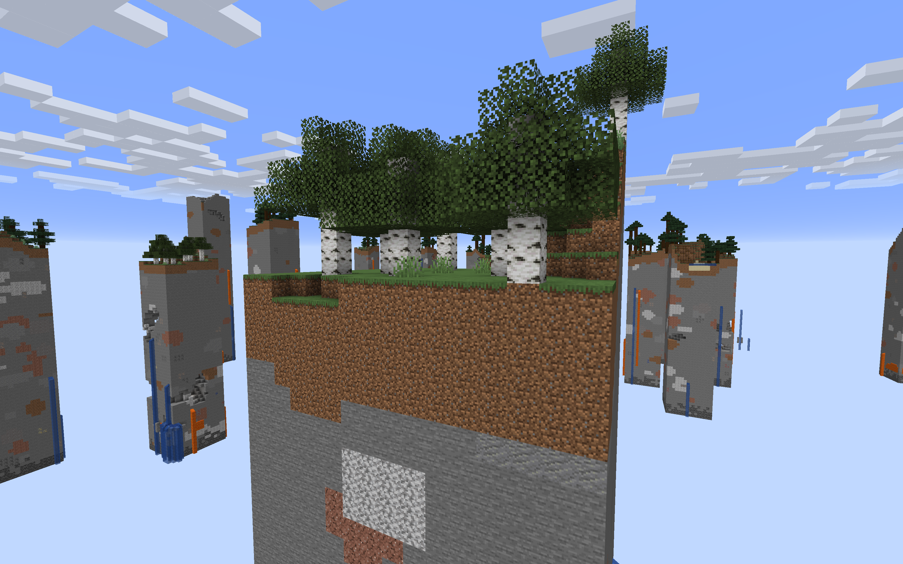

# SkyChunk

[>> Downloads <<](https://github.com/Boundarybreaker/SkyChunk/releases)

*Watch your step!*

**This mod is open source and under a permissive license.** As such, it can be included in any modpack on any platform without prior permission. We appreciate hearing about people using our mods, but you do not need to ask to use them. See the [LICENSE file](LICENSE) for more details.

SkyChunk removes 95% of all chunks from the world, replacing them with air. Structures and the water in flooded caves are still preserved due to limitations with the generation system.

This mod was made on request from ThatNEET_ on Twitch! If you want your own Fabric mod request, you can get one by watching [LemmaEOF](https://twitch.tv/LemmaEOF)'s streams.

## About Forge

SkyChunk uses **Forgery Tools** for its Forge port, as it is a primarily mixin mod. Forgery Tools is not currently publicly available. Please keep this in mind if you want to PR new features.